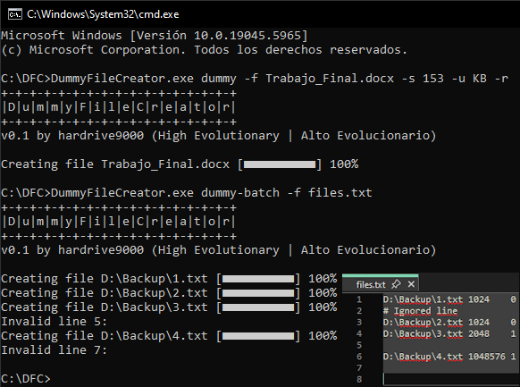
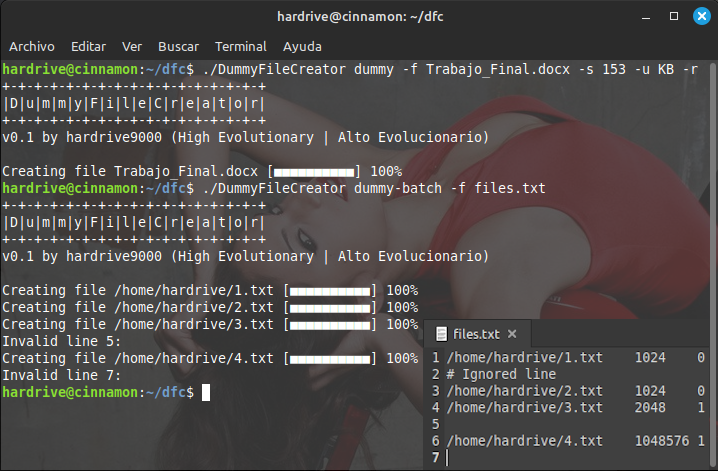

# Dummy File Creator Console Application

A high-performance console application built with **C# .NET 9** for generating dummy files of arbitrary sizes. Designed for disk performance testing, network benchmarking, application testing, and data security operations. It uses [Cocona micro-framework](https://www.nuget.org/packages/Cocona.Lite/) that makes it easy and fast to build console applications on .NET providing command-line option semantics like UNIX tools standard.

## 🎯 Features

- **Arbitrary file size generation**: Support for files ranging from bytes to gigabytes
- **Configurable content patterns**: Generate compressible or pseudo-random content
- **Command-line interface**: Scriptable and automation-friendly
- **High-performance implementation**: Optimized for large file generation with minimal memory footprint
- **Cross-platform compatibility**: Runs on Windows, Linux, and macOS via .NET 9

## 🚀 Use Cases

### Cheating on assignments
- Due to network errors, a file attached to an email or uploaded to an educational platform may become corrupted, meaning it may contain errors. It's possible to delay the submission of an assignment if a file is generated with this application to gain extra time -a few hours or even days- until the file is requested to be resubmitted.

### Fool people on peer-to-peer file sharing networks
- Although most peer to peer network programs have built-in CRC/Hashing check to prevent malicious fake files, a person can still share fake files with the same file name or catching program/media title to confuse P-to-P users.

### Enhance protection of existing encryption
- Put a few fake files with randomly generated content along with your encrypted files. Investigators will have tough time finding/decrpyting your files, since they won't even know which one to start with!

### Performance Testing
- **Disk I/O benchmarking**: Measure sequential write/read performance
- **Network throughput testing**: Generate payloads for bandwidth measurement
- **Storage capacity analysis**: Test storage device behavior under various loads
- **File system stress testing**: Evaluate file system performance characteristics

### Security and Data Management
- **Secure data wiping**: Overwrite free disk space to prevent data recovery
- **Forensic countermeasures**: Generate decoy files for data obfuscation

## 📋 Requirements

- **.NET 9 Runtime** or higher

## 🛠️ Compiling and Running
To run the application:

1. Clone the repository
2. Build the project using .NET 9 SDK
3. Run the executable from the command line

```bash
dotnet build
```

### Single File Generation
```bash
DummyFileCreator.exe dummy -f FULL_FILENAME -s FILE_SIZE -u UNITS [-r]
```

| Parameter | Type | Description | 
|-----------|------|-------------|
| `FULL_FILENAME` | String | Absolute or relative path for output file |
| `FILESIZE` | Int64 | Target file size |
| `UNITS` | Enum | B, KB, MB, GB |
| `[-r]` | Boolean | Random switch. Optional |

### Batch File Generation
```bash
DummyFileCreator.exe dummy-batch -f FULL_FILENAME
```

Batch file list is a pure text file contain lines of following format:  
FULL_FILENAME<kbd>TAB</kbd>FILESIZE_IN_BYTES<kbd>TAB</kbd>RANDOM_SWITCH<kbd>ENTER</kbd>

| Parameter | Type | Description | 
|-----------|------|-------------|
| `FULL_FILENAME` | String | Absolute or relative path for output file |
| `FILESIZE_IN_BYTES` | Int64 | Target file size **in bytes** |
| `RANDOM_SWITCH` | Boolean | Random switch. 1 or 0 |

So a typical batch list would contain lines similar like the following:  

C:\Temp\Directory 1\1.txt<kbd>TAB</kbd>1024<kbd>TAB</kbd>0<kbd>ENTER</kbd>  
C:\Temp\1.txt<kbd>TAB</kbd>0<kbd>TAB</kbd>0<kbd>ENTER</kbd>  
C:\Temp\2.txt<kbd>TAB</kbd>1024<kbd>TAB</kbd>0<kbd>ENTER</kbd>  
C:\Temp\3.txt<kbd>TAB</kbd>2048<kbd>TAB</kbd>1<kbd>ENTER</kbd>  
C:\Temp\4.txt<kbd>TAB</kbd>1048576<kbd>TAB</kbd>1<kbd>ENTER</kbd>

*DummyFileCreator running on Windows 10 22H2 Visual Studio 2022 17.13.7*  
  

*DummyFileCreator running on Linux Mint Cinnamon 21.3 VS Code 1.100.8 C# Dev Kit Extension*  
  

## ⚙️ Technical Implementation

### Architecture Overview
The application implements a streaming-based file generation approach to maintain consistent memory usage regardless of output file size.

### Content Generation Algorithms

**Compressible Content**: Generates files filled with repeating byte patterns (default: 0x00 NULL character). These files achieve high compression ratios and are suitable for testing compression algorithms and storage efficiency.

**Pseudo-Random Content**: Utilizes cryptographically secure pseudo-random number generators to create content that resists compression. Suitable for realistic I/O testing and security applications.

### Content Generation Details

**Compressible Pattern**: 
- Repeating byte sequences
- Compression ratio: ~1000:1 typical
- Use case: Compression algorithm testing, storage efficiency analysis

**Pseudo-Random Content**:
- Cryptographically secure random number generation
- Compression resistance: >99% of original size
- Use case: Realistic I/O testing, security applications

### File Generation Strategy
The application uses a chunked writing approach for optimal performance:
- Default chunk size: 4MB

## 📄 License

This project is licensed under the Apache License. See the `LICENSE` file for complete terms and conditions.

## 🤝 Acknowledgments

Inspired by the original [Dummy File Creator](https://www.mynikko.com/dummy/) by Nikko Cheng, reimagined as a modern, cross-platform console application with enhanced performance and functionality.
